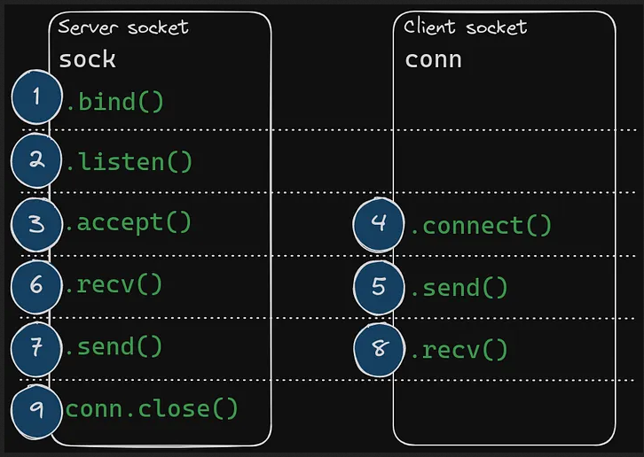
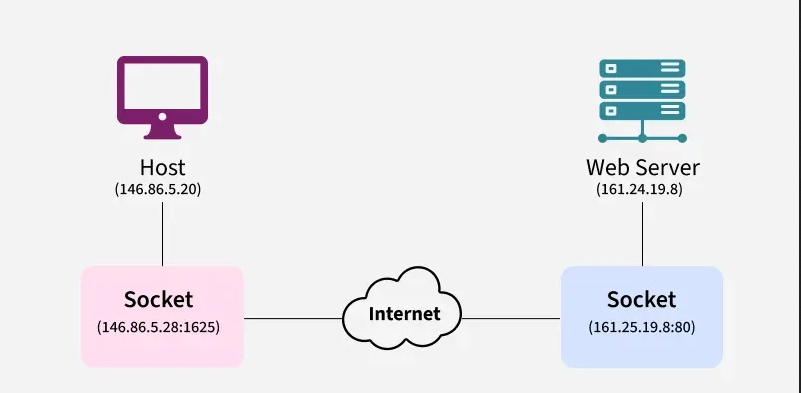

include <sys/socket.h>

## `bind`
	int	bind( int socket, const struct sockaddr *address, socklen_t address_len );

returns success: 0
return fail: -1

use the Bide function to assign a unique local name (network address) to a socket
attaches a socket to a specific IP address and port so the server can receive connections on that address

## `listen`
	int	listen( int socket. int backlog );

returns success: 0;
return fail: -1

listens for connections on a socket and puts the socket into the LISTEN state

## `accept`
	int	accept( int socket, struct sockaddr *restrict address,
       socklen_t *restrict address_len);

returns success: non-negative file descriptor of the accepted socket
returns fail: -1

used by a server to aacept a connection request from a client

## `connect`

int connect(int socket, const struct sockaddr *address,
       socklen_t address_len);

returns success: 0;
return fail: -1

establish a connection on a connection-oriented socket or establish the destination address on a connectionless socket

## `send`
	ssize_t send(int socket, const void *buffer, size_t length, int flags);

returns success: number of bytes sent
return fail: -1

sends data on the socket with descriptor socket
initiates transmission of a message from the specified socket to its peer

## `recv`
	ssize_t recv(int socket, void *buffer, size_t length, int flags);

returns success: length of the message in bytes
return fail: -1

receives data on a socket with descriptor socket and stores it in buffer

## `close`
	include <manifest.h>
	include <socket.h>

	int	close( int d );
		d -> descriptor of the socket to be closed

returns success: 0;
return fail: -1

shuts down the socket associated with the socket descriptor d and frees resources allocated to the socket. If s refers to an open TCP connection, the connection is closed

 

include <sys/socket.h>

## `socket`
	int socket(int domain, int type, int protocol);

	domain: AF_LOCAL as defined in the POSIX standard for communication between processes on the same host
	type: SOCK_STREAM: TCP(reliable, connection-oriented)
	protocol: specifies a particular protocol to be used with the socket. Specifying a protocol of 0 causes socket() to use an unspecified default protocol appropriate for the requested socket type

returns success: file descriptor for the new socket
returns fail: -1

create an endpoint for communication

## `socketpair`
	int socketpair(int domain, int type, int protocol, int sv[2]);

returns success: 0;
return fail: -1

create a pair of connected sockets

## `setsockopt`
	int setsockopt(int socket, int level, int option_name, const void *option_value, socklen_t option_len);

returns success: 0;
return fail: -1

Prevents error such as: “address already in use”.

	example:
		int opt = 1;
		setsockopt(server_fd, SOL_SOCKET, SO_REUSEADDR, &opt, sizeof(opt));

after our server is restarted `SO_REUSEADDR` allows a server to bind to a port that may still be marked as in use (e.g., in the TIME_WAIT state) preventing the "Address already in use" error

configures the behavior of an existing socket by setting specific operating system-level options such as address reuse, timeouts, buffer size.

## `getsockname`
	int getsockname(int socket, struct sockaddr *restrict address, socklen_t *restrict address_len);

returns success: 0;
return fail: -1

retrieves the local address (IP and port) currently assigned to a socket
