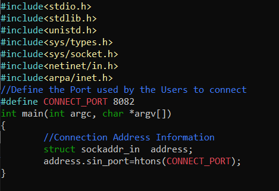

include <sys/socket.h>

## `bind`
	int	bind( int socket, const struct sockaddr *address, socklen_t address_len );

returns success: 0
return fail: -1

use the Bide function to assign a unique local name (network address) to a socket
attaches a socket to a specific IP address and port so the server can receive connections on that address

## `listen`
	int	listen( int socket. int backlog );

returns success: 0;
return fail: -1

listens for connections on a socket and puts the socket into the LISTEN state

## `accept`
	int	accept( int socket, struct sockaddr *restrict address,
       socklen_t *restrict address_len);

returns success: non-negative file descriptor of the accepted socket
returns fail: -1

used by a server to aacept a connection request from a client

## `connect`

int connect(int socket, const struct sockaddr *address,
       socklen_t address_len);

returns success: 0;
return fail: -1

establish a connection on a connection-oriented socket or establish the destination address on a connectionless socket

## `send`
	ssize_t send(int socket, const void *buffer, size_t length, int flags);

returns success: number of bytes sent
return fail: -1

sends data on the socket with descriptor socket
initiates transmission of a message from the specified socket to its peer

## `recv`
	ssize_t recv(int socket, void *buffer, size_t length, int flags);

returns success: length of the message in bytes
return fail: -1

receives data on a socket with descriptor socket and stores it in buffer

## `close`
	include <manifest.h>
	include <socket.h>

	int	close( int d );
		d -> descriptor of the socket to be closed

returns success: 0;
return fail: -1

shuts down the socket associated with the socket descriptor d and frees resources allocated to the socket. If s refers to an open TCP connection, the connection is closed

 

include <sys/socket.h>

## `socket`
	int socket(int domain, int type, int protocol);

	domain: AF_LOCAL as defined in the POSIX standard for communication between processes on the same host
	type: SOCK_STREAM: TCP(reliable, connection-oriented)
	protocol: specifies a particular protocol to be used with the socket. Specifying a protocol of 0 causes socket() to use an unspecified default protocol appropriate for the requested socket type

returns success: file descriptor for the new socket
returns fail: -1

create an endpoint for communication

## `socketpair`
	int socketpair(int domain, int type, int protocol, int sv[2]);

returns success: 0;
return fail: -1

create a pair of connected sockets

## `setsockopt`
	int setsockopt(int socket, int level, int option_name, const void *option_value, socklen_t option_len);

returns success: 0;
return fail: -1

Prevents error such as: “address already in use”.

	example:
		int opt = 1;
		setsockopt(server_fd, SOL_SOCKET, SO_REUSEADDR, &opt, sizeof(opt));

after our server is restarted `SO_REUSEADDR` allows a server to bind to a port that may still be marked as in use (e.g., in the TIME_WAIT state) preventing the "Address already in use" error

configures the behavior of an existing socket by setting specific operating system-level options such as address reuse, timeouts, buffer size.

## `getsockname`
	int getsockname(int socket, struct sockaddr *restrict address, socklen_t *restrict address_len);

returns success: 0;
return fail: -1

retrieves the local address (IP and port) currently assigned to a socket

## `htons` `htonl`
include <arpa/inet.h>

returns success: the argument value converted from host to network byte order
returns fail: no errors are defined

- uint16_t		htons( uint16_t hostshort bits);

same as `htonl` except:
host ---> network short
used for port ( short - 16-bit value )
converts a 16-bit value from host-byte order to network-byte order

example:
		struct sockaddr_in	addr;
		addr.sin_family = AF_INET;
		addr.sin_port = htons(8080); ---> without it bind() doesn't work correctly

-  uint32_t		htonl( uint32_t hostlong );

same as `htons` except:
host ---> network long
used for IP address ( long - 32-bit value )
converts a 32-bit value from host-byte order to network-byte order

## `ntohs` `ntohl`
include <arpa/inet.h>

the opposite functions to `htons` `htonl`

returns success: return the argument value converted from network to host byte order
returns fail: no errors are defined

- `ntohs`
uint16_t	ntohs( uint16_t netshort) ;
network short ---> host ( port )

- `ntohl`
uint32_t	ntohl( uint32_t netlong );
network long ---> host  ( IP addresses )

## `epoll`

#include <sys/epoll.h>
the simple way to handle multiple clients would be `epoll`

- epoll_create()
	
	int epoll_create(int size);

	returns success: file descriptor (a nonnegative integer)
	return fail: -1

	creates a new epoll() instance
	is a dynamic structure so parameter `size` is ignored ( can put any number > 0 )

- epoll_ctl()

	 int epoll_ctl(int epfd, int op, int fd, struct epoll_event *_Nullable event);

	 return success: 0
	 returns fail: -1

	 this system call is used to add, modify, or remove entries in the interest list of the epoll () instance referred to by the file `descriptor epfd`

	 `op` can be:
	- EPOLL_CTL_ADD
	- EPOLL_CTL_MOD
	- EPOLL_CTL_DEL

	`fd` is a target file descriptor for operation `op`

	`struct epoll_event` {
           uint32_t      events;  /* Epoll events */
           epoll_data_t  data;    /* specifies data that the kernel should save and then return */
       };
	   the epoll_event structure specifies data that the kernel should save and return when the corresponding file descriptor becomes ready
	     
		 union epoll_data {
           void     *ptr;
           int       fd;
           uint32_t  u32;
           uint64_t  u64;
       };

- epoll_wait()

	int		epoll_wait( int epfd, struct epoll_event *events, int maxevents, int timeout );
	
	returns success: the number of file descriptors ready for the requested I/O operation
	returns fail: -1

	the `timeout` argument specifies the minimum number of milliseconds that epoll_wait() will block.
	wait for an I/O event on an epoll file descriptor referred by the epfd

	example:
			struct epoll_event events[5];
			int epfd = epoll_create(10);
			...
			...
			for (i=0;i<5;i++) 
			{
				static struct epoll_event ev;
				memset(&client, 0, sizeof (client));
				addrlen = sizeof(client);
				ev.data.fd = accept(sockfd,(struct sockaddr*)&client, &addrlen);
				ev.events = EPOLLIN;
				epoll_ctl(epfd, EPOLL_CTL_ADD, ev.data.fd, &ev); 
			}
			
			while(1){
				puts("round again");
				nfds = epoll_wait(epfd, events, 5, 10000);
				
				for(i=0;i<nfds;i++) {
						memset(buffer,0,MAXBUF);
						read(events[i].data.fd, buffer, MAXBUF);
						puts(buffer);
				}
			}

## `getaddrinfo`
	include <sys/types.h>
    include <sys/socket.h>
    include <netdb.h>

	int		getaddrinfo(const char *restrict node, const char *restrict service, const struct addrinfo *restrict hints, struct addrinfo **restrict res);

returns success: 0
returns fail:  one of the following nonzero error codes: EAI_ADDRFAMILY etc

resolves a hostname and port into socket-ready address structures for use with bind or connect

	     struct addrinfo {
               int              ai_flags;
               int              ai_family;
               int              ai_socktype;
               int              ai_protocol;
               socklen_t        ai_addrlen;
               struct sockaddr *ai_addr;
               char            *ai_canonname;
               struct addrinfo *ai_next;
           };

example: 
			 include <cstring> 

		struct addrinfo		hints;
		struct addrinfo		*res;

		memset( &hints, 0, sizeof( hints ) );
		hints.ai_family	= AF_INET;
		hints.ai_socktype = SOCK_STREAM;
		hints.ai_flags = AI_PASSIVE;

		int status = getaddrinfo( NULL, "8080", &hints, &res );
		if ( status != 0 ) //error

		int		sock = socket( res->ai_family,
								res->ai_socktype,
								res->ai_protocol);

		bind( sock, res->ai_addr, res->ai_addrlen );

## `freeaddrinfo`

void	freeaddrinfo( struct addrinfo *ai );

returns success: 0
returns fail: a non-zero value

free one or more addrinfo structures returned by getaddrinfo(), along with any additional storage associated with those structures

## `getprotobyname`
#include <netdb.h>

struct protoent		*getprotobyname( const char *name );

struct protoent {
    char  *p_name;       /* official protocol name */
    char **p_aliases;    /* alias list */
    int    p_proto;      /* protocol number */
}

returns success: a pointer to a statically allocated protoent structure
returns fail: NULL pointer

## `stat`
#include <sys/stat.h>

int		stat( const char *restrict path, struct stat *restrict buf );

returns success: 0;
return fail: -1

retrieves information about a file ( type, size, permission, timestamps ) from the filesystem