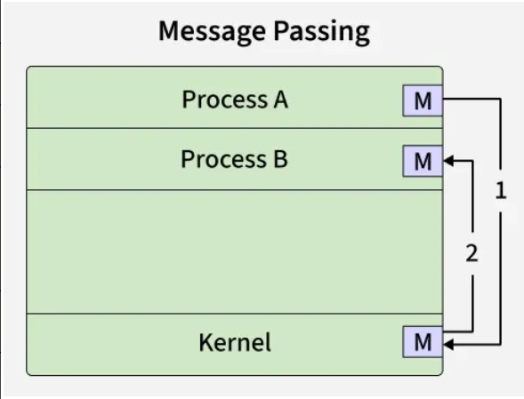

## `URL` = Uniform Resource Locators
	is the address that specifies where a resource is located on the internet and how to access it

http_URL = "http:" "//" host [ ":" port ] [ abs_path [ "?" query ]]
If the port is empty or not given, port 80 is assumed.

## Method `GET`
	retrieves a resource without modifying the server state
	[Give me the resource]

## Method `POST`
	sends data to the server to create or modify a resource
	[Do smth with this resource]

## Method `DELETE`
	requests the server to remove a specified resource
	[delete this resource]


## request-response

- google "flowers"
- browser=client ( example: Mozilla ) creates a HTTP request and sends it to Google=host=origin server
	example:
			GET /search?q=flowers HTTP/1.1
			Host: www.google.com  

	example:

			GET /hello.txt HTTP/1.1
			User-Agent: curl/7.64.1
			Host: www.example.com
			Accept-Language: en, mi


- host listens for request -> receives a request -> parses it -> executes internal logique( algorithms, data base, indices ) -> creates a HTTP response
	example:
			HTTP/1.1 200 OK
			Content-Type: text/html
			Content-Length: 12345

			<html> ... result ... </html>

	example:


### to see a real http request
		```bash
		python3 -m http.server 8080 &
		curl -v http://localhost:8080/
		```

## Socket

		Message Passing is a method where processes communicate by sending and receiving messages to exchange data. One process sends a message and the other process receives it, allowing them to share information. Message Passing can be achieved through different methods like Sockets, Message Queues or Pipes.



Process A  →  Kernel  →  Network stack  →  Internet  →  Kernel  →  Process B
🔥 In the case of a TCP server

When a browser connects to web server:

1️⃣ The browser sends the request to its local kernel.
2️⃣ The kernel initiates the TCP handshake.
3️⃣ The server’s kernel receives the SYN packet.
4️⃣ The server’s kernel notifies your process through accept().
5️⃣ At this point, the connection is established.
